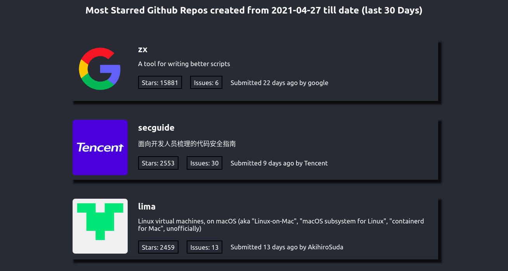

# Starred GitHub Repositories

> A small webapp that lists the most starred Github repos that were created in the last 30 days from [GitHub Public API](https://api.github.com/) into React state. The JSON data fetched directly from the API is rendered to the users. As teh user keeps scrolling, new results are automatically fetched and rendered to the user.

## Built With

- SCSS (BEM structure)
- npm & ES6
- React (Create-React-App)
- [`Infinite Scroll`](https://www.npmjs.com/package/react-infinite-scroll-component) & [`react-loading`](https://www.npmjs.com/package/react-loading) NPM packages.
- ESLint & StyleLint
- 

## Live Demo

[Starred Repositories](https://gemo-starred-repos.netlify.app)

## Getting Started

**To Clone and get a local copy up and running follow these simple example steps.**

- On the project GitHub page, navigate to the main page of the repository: [this page](https://github.com/teekaytech/Gemography-Frontend-Challenge).
- Under the repository name, locate and click on a green button named `Code`.
- Copy the project URL (under `HTTPS`)as displayed.
- If you're running Windows Operating System, open your command prompt. On Linux, Open your terminal.
- Change the current working directory to the location where you want the cloned directory to be made. Leave as it is if the current location is where you want the project to be.
- Type `git clone`, and then paste thesrc/screenshots/page-one.pngaytech/Gemography-Frontend-Challenge.git` <em>Press Enter key</em> 
- Press Enter. Your local copy will be created.
- Checkout to the development branch with: `git checkout development`

Please Note that you must have github installed on your PC, this can be done

### Making Changes / Running the app locally

- Run `npm install` to install the dependencies and packages
- Run `npm start` to test the app before or after changes were made

### Prerequisites

- [Git](https://gist.github.com/derhuerst/1b15ff4652a867391f03).
- Web browser (Chrome/Firefox)
- [Node](https://nodejs.org/en/)
- [NPM](https://www.npmjs.com/get-npm)

### Usage

Click on the live demo link and peruse the app.

## Author

👤 **Taofeek Olalere**

- Github: [@teekaytech](https://github.com/teekaytech)
- Twitter: [@ola_lere](https://twitter.com/ola_lere)
- Linkedin: [olaleretaofeek](https://linkedin.com/in/olaleretaofeek)
- Portfolio: [Olalere Taofeek](https://teekaytech.github.io/olaleretaofeek/)

## 🤝 Contributing

Contributions, issues and feature requests are welcome!

Feel free to check the [issues page](https://github.com/teekaytech/Gemography-Frontend-Challenge/issues).

## Show your support

Give a ⭐️ if you like this project!

## Acknowledgments

- [create-react-app boilerplate from Facebook team](https://github.com/facebook/create-react-app)
- [Netlify](https://app.netlify.com/)
- [Infinite Scroll](https://www.npmjs.com/package/react-infinite-scroll-component)
- [React Loading](https://www.npmjs.com/package/react-loading)

## 📝 License

This project is [MIT](/LICENSE) licensed.
